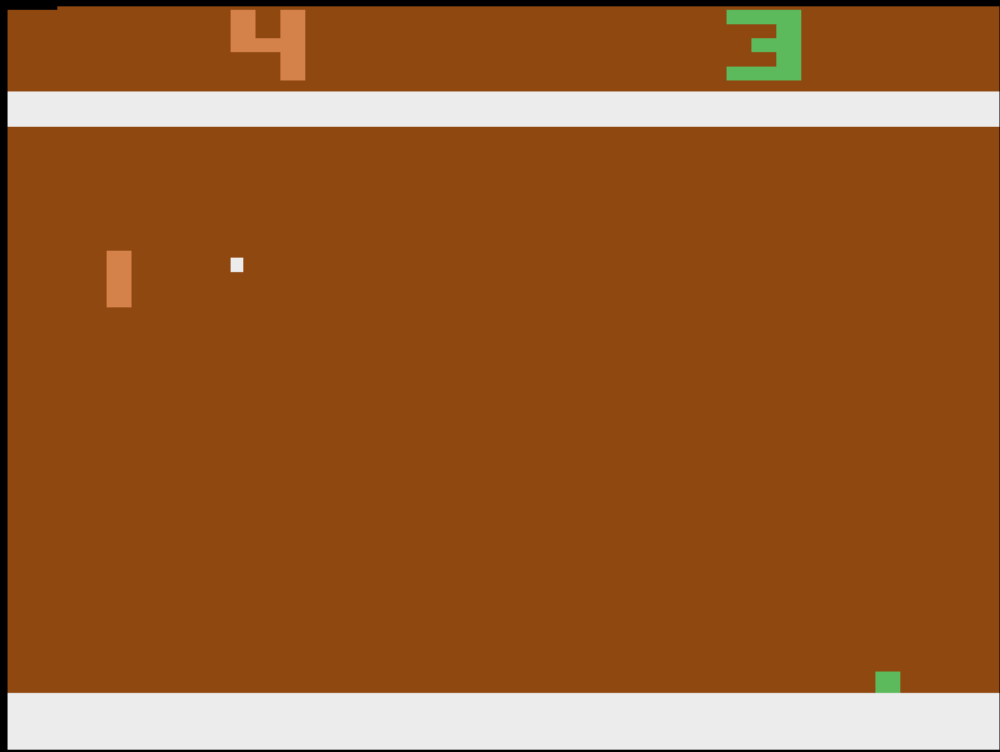
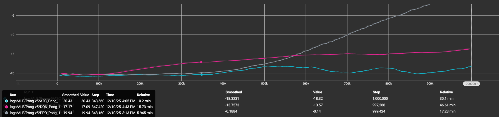

# Reinforcement Learning Final Project – Pong Environment (PPO / A2C / DQN)

본 프로젝트는 **Gymnasium의 Atari Pong 환경**을 사용하여  
강화학습 알고리즘 **PPO, A2C, DQN**을 학습시키고 성능을 비교·분석한 결과를 정리한 것입니다.



---

## 1. 프로젝트 개요

- **환경(Environment)**: `ALE/Pong-v5`
- **알고리즘**: PPO, A2C, DQN
- **프레임워크**: Stable-Baselines3
- **하이퍼파라미터 참고**: RL-Baselines3-Zoo (`ppo.yml` Atari preset)

---

## 2. 환경 선택 이유

Atari Pong은 반도체 결함 검사와 직접적으로 동일하지는 않지만,  
다음과 같은 유사성을 가진 환경

- **픽셀 기반 이미지 입력 → 에이전트는 CNN을 통해 공/패들 위치 패턴을 인식 → 패턴 기반으로 적절한 행동(action)을 결정**  
- 이는 반도체 결함 검사에서도
- **카메라 이미지 → CNN 기반 결함 여부 판단 → PASS/REJECT 판단** 
과 같은 구조를 갖는 것과 유사하다고 생각해서 선택함

State
- Pong의 상태는 4개의 프레임을 쌓은 84×84 그레이스케일 이미지로 구성
- 84×84: AtariPreprocessing에서 resize됨
- Grayscale: 입력을 단순화
- 4 Frames (FrameStack): 공의 속도와 방향을 추론하기 위함
+ 추가로 포함된 정보
내 패들의 위치
상대 패들의 위치
공의 현재 위치
공의 이동 방향 (4프레임을 통해 추론)
배경(검은색), 벽, 타이밍 정보

Action 
- 

Reward 
- 


---

## 3. 실험 환경 및 구성

### 개발 환경
- WSL2 (Ubuntu 22.04)
- Python 3.10 / Conda
- Gymnasium 1.2.2  
- Stable-Baselines3  
- ALE-py (Atari emulator)
- TensorBoard

### 전처리 (Atari preprocessing)
- Gray + Resize(84×84)
- CnnPolicy

---

## 4. 알고리즘 및 하이퍼파라미터

### PPO (Policy Gradient)
- learning_rate = 2.5e-4  
- n_steps = 128  
- batch_size = 256  
- gamma = 0.99  
- n_epochs = 4  
- ent_coef = 0.01  
- clip_range = 0.1  

### A2C
- learning_rate = 7e-4  
- n_steps = 5  

### DQN
- learning_rate = 2.5e-4  
- buffer_size = 100,000  
- exploration ε: 1.0 → 0.01  
- target update every 10,000 steps  

---

## 5. 실험 결과 및 분석

### Episode Length (ep_len_mean)
TensorBoard에서 약 1M timesteps 학습 결과를 비교

- **PPO(17min) > A2C(30min) > DQN(46min)** 순으로 학습 속도 빠름  
- PPO는 가장 빠르고 안정적 (정책이 너무 크게 변하지 않도록 제한하는 Clipped Objective 사용, Advantage 사용으로 variance 줄임)
- DQN은 일정하게 증가하며 PPO 다음으로 우수 (ε-greedy 탐색, replay buffer의 반영 지연, value-based의 간접 업데이트 구조 때문에 학습이 느림)
- A2C는 불안정한 패턴 (Actor-Critic이 variance가 크고, PPO처럼 안정화 기법이 없음)

### Episode Reward (ep_rew_mean)
- **PPO**: -20 부근에서 시작하여 0 근처까지 꾸준히 상승
- **DQN**: -20 → -13 수준으로 개선
- **A2C**: 거의 개선되지 않음

### FPS (학습 속도)
- PPO ≈ 900 FPS  
- A2C ≈ 550 FPS  
- DQN ≈ 350 FPS  

**최종 결론: PPO가 가장 빠르고 안정적으로 최고의 성능을 냄**

---


## 6. 실행 방법

### 학습

```bash
python train_ppo_pong.py
python train_a2c_pong.py
python train_dqn_pong.py
```

### TensorBoard

```bash
tensorboard --logdir logs
```

### 모델 평가

```bash
python run_pong.py
```

---

## 7. 프로젝트 구조

```
project/
├── train_ppo_pong.py
├── train_a2c_pong.py
├── train_dqn_pong.py
├── eval_pong.py
├── utils.py
├── models/ *첨부파일
├── logs/
└── README.md
```
